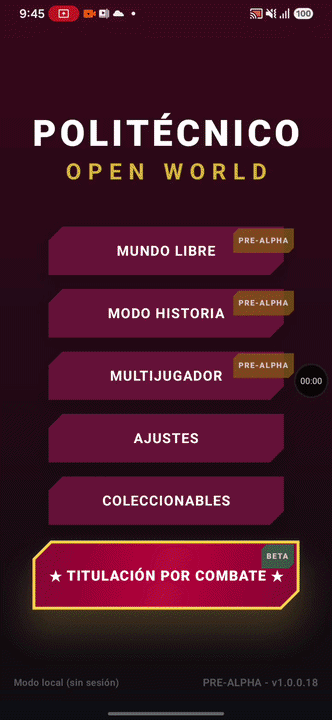
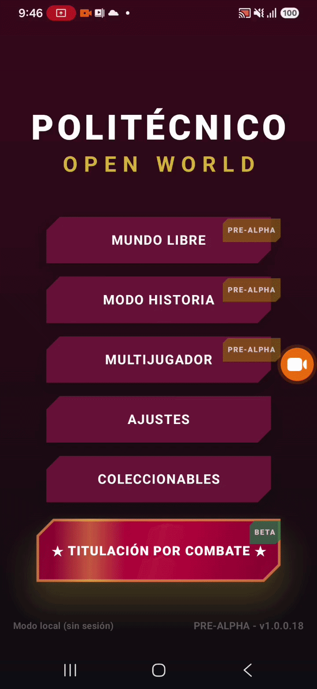
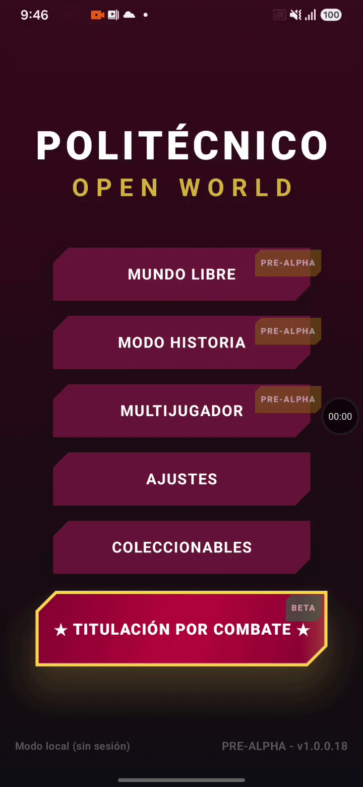
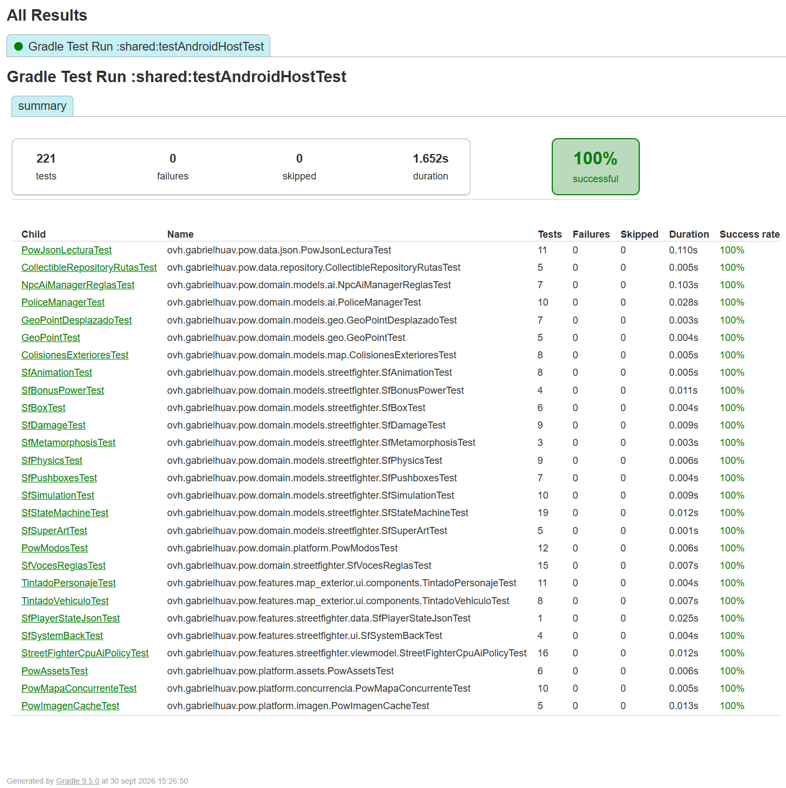
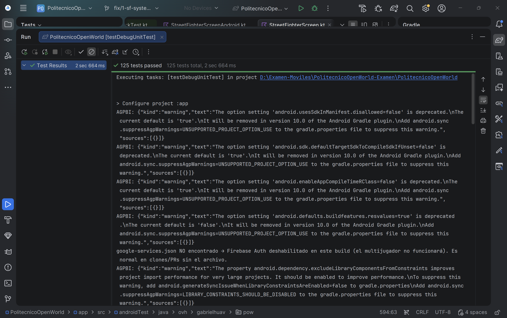
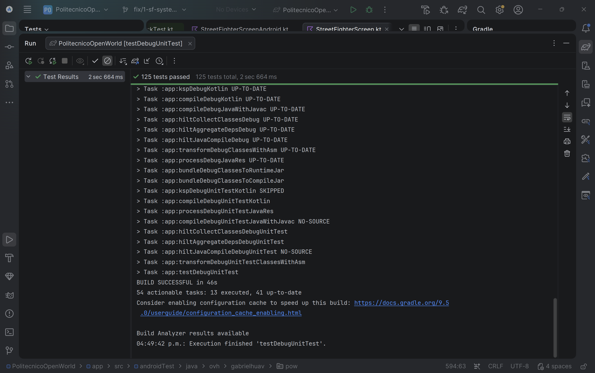
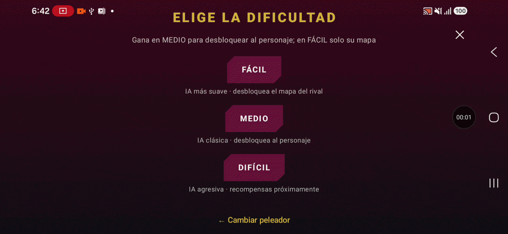
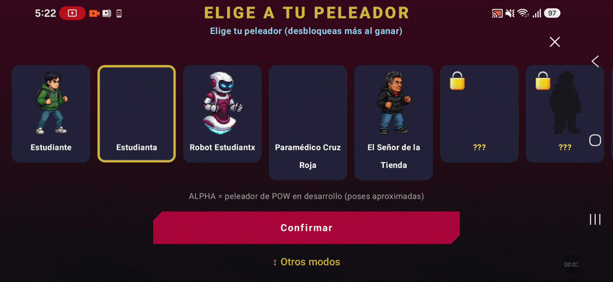
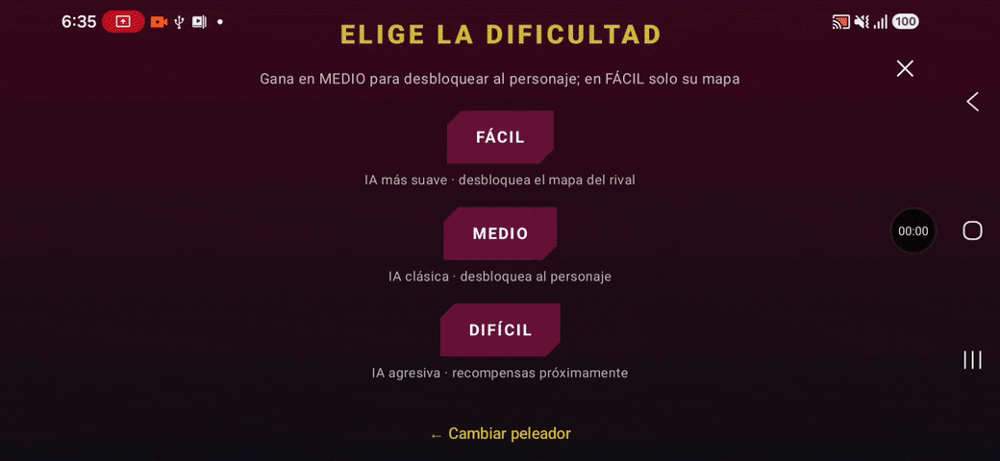

# Documento de desarrollo — Atrás del sistema en HUELUM VS. GOYA

**PR:** [#160](https://github.com/gabrielhuav/PolitecnicoOpenWorld/pull/160) · **Issue:** [#1](https://github.com/xime-ngrn/PolitecnicoOpenWorld-Examen/issues/1) · **Rama:** `fix/1-sf-system-native-back-dialog` · **SHA base:** `7ed3253` · **SHA del cambio:** `c461a770`

## 1. Contexto y problema

En el modo de pelea HUELUM VS. GOYA, el botón **✕** de la pantalla abre un diálogo de confirmación antes de salir del combate. El botón o gesto **Atrás del sistema** de Android no pasaba por ese diálogo: regresaba directo al menú principal y la pelea se perdía sin confirmación. Afecta a cualquier jugador en Android, sobre todo con navegación por gestos, donde es fácil deslizar desde el borde por accidente.

| Comportamiento esperado (✕) | Error: Atrás con botón ◁ | Error: Atrás con gesto |
|:---:|:---:|:---:|
|  |  |  |

## 2. Alcance y criterios de aceptación

Criterios definidos en el issue #1:

- **AC1:** en una pelea sin conexión, Atrás abre el diálogo de salida y la pelea se congela; cada opción funciona: *Salir* → menú principal, *Cambiar personaje* → selector, *Seguir peleando* → reanuda.
- **AC2:** con el diálogo abierto, Atrás lo cierra; varias pulsaciones rápidas no sacan del juego ni lo cierran inesperadamente.
- **AC3:** en línea, el diálogo muestra solo *Salir* y *Seguir peleando*.

**Fuera de alcance:** Atrás dentro de los submenús de selección, cambios al flujo en línea e implementación en iOS.

## 3. Justificación del enfoque

El objetivo fue un arreglo pequeño y acotado que no comprometiera el código original. Otras partes del juego, como el mapa del mundo ([PR #38](https://github.com/gabrielhuav/PolitecnicoOpenWorld/pull/38)), ya tienen su propio diálogo de salida que capta el Atrás del sistema; un cambio en la navegación global (`MainActivity`) habría podido interferir con ellos. Por eso:

- **El manejo de Atrás se agrega solo en la pantalla de pelea**, y solo mientras hay combate. Fuera de él, Android conserva su comportamiento normal.
- **Se reutiliza lo que ya existía:** el mismo diálogo que abre la ✕, las acciones del controlador (`requestExit`, `dismissExitDialog`, `forcePause` y `backToCharacterSelect`) y el texto ya traducido `sf_change_character`. No se modificaron el ViewModel, el estado de la pelea, los textos ni las dependencias.
- **La decisión de qué hacer con Atrás se separó en lógica pura** (`SfSystemBack.kt`, en `commonMain`), sin Compose, para poder probarla con pruebas unitarias sin dispositivo.
- **El `BackHandler` vive en el módulo `app`** (`StreetFighterScreenAndroid.kt`) porque es una API exclusiva de Android y la versión de iOS queda fuera de alcance.

## 4. Funcionalidades agregadas y modificadas

### Atrás del sistema durante la pelea

| Situación | Acción al pulsar Atrás |
|---|---|
| Selector de personaje y submenús | Comportamiento normal del sistema (sin cambios) |
| Pelea en curso, sin diálogo | Abre el diálogo de salida; la pelea se congela |
| Pelea con el diálogo abierto | Cierra el diálogo; la pelea continúa |

### Diálogo de salida

El diálogo es el mismo para la ✕ y para Atrás, así que la nueva opción aparece en ambos casos.

| Opción | Sin conexión | En línea | Comportamiento |
|---|:---:|:---:|---|
| Salir | ✓ | ✓ | Guarda la sesión de arcade y regresa al menú principal (ya existía). |
| Seguir peleando | ✓ | ✓ | Cierra el diálogo y reanuda la pelea donde estaba (ya existía). |
| Cambiar personaje | ✓ | — | **Nueva.** Guarda la sesión de arcade igual que *Salir*, cierra el diálogo y regresa al selector sin salir del modo de pelea. |

*Cambiar personaje* no se ofrece en línea porque abandonaría la sala del rival. Al elegir otro personaje, el juego reinicia la escena de combate, por lo que la partida empieza desde cero (ver TC-03 en [PRUEBAS.md](PRUEBAS.md)).

### Archivos

| Archivo | Cambio | Descripción |
|---|---|---|
| `app/.../streetfighter/ui/StreetFighterScreenAndroid.kt` | Modificado | Observa el estado de la pelea y registra un `BackHandler` que solo se activa fuera del selector; según la acción decidida, abre o cierra el diálogo de salida. |
| `shared/.../commonMain/.../ui/SfSystemBack.kt` | Nuevo | Define las tres acciones posibles de Atrás (`SISTEMA`, `ABRIR_DIALOGO`, `CERRAR_DIALOGO`), la función que elige una según el estado y la regla que permite *Cambiar personaje* solo sin conexión. |
| `shared/.../commonMain/.../ui/StreetFighterScreen.kt` | Modificado | El botón de confirmación del diálogo pasa a ser una fila con *Cambiar personaje* (solo sin conexión) y *Salir*. |
| `shared/.../commonTest/.../ui/SfSystemBackTest.kt` | Nuevo | Cuatro pruebas unitarias de la lógica de `SfSystemBack.kt`. |

En total: 4 archivos (+105 / −5 líneas), sin dependencias nuevas ni cambios en datos guardados.

## 5. Pruebas unitarias

| Prueba | Verifica | Criterio |
|---|---|---|
| `atras en combate abre el dialogo de salida` | En pelea sin diálogo, Atrás abre el diálogo | AC1 |
| `atras con el dialogo abierto lo cierra` | Con el diálogo abierto, Atrás lo cierra | AC2 |
| `atras en el selector conserva el comportamiento del sistema` | En el selector, Atrás conserva el comportamiento normal | Alcance |
| `cambiar personaje solo se ofrece sin conexion` | La opción solo existe sin conexión; en cualquier estado en línea se oculta | AC3 |

**Resultado:** 4 de 4 aprobadas (`testAndroidHostTest` del módulo `shared`, 30/09/2026).

**Código de las pruebas:** [SfSystemBackTest.kt](https://github.com/xime-ngrn/PolitecnicoOpenWorld-Examen/blob/c461a770424e01210d0f4f3b204f648336532749/PolitecnicoOpenWorld/shared/src/commonTest/kotlin/ovh/gabrielhuav/pow/features/streetfighter/ui/SfSystemBackTest.kt)

Las capturas muestran además la ejecución de `testDebugUnitTest` del módulo `app` sin regresiones (125 pruebas aprobadas):

Los casos de prueba manuales, la preparación del entorno y los problemas encontrados con Gradle están en [PRUEBAS.md](PRUEBAS.md).

## 6. Evidencia después del cambio

| Salir | Seguir peleando | Cambiar personaje |
|:---:|:---:|:---:|
|  |  |  |

## 7. Riesgos, limitaciones y rollback

- **Otras pantallas:** el `BackHandler` solo está activo durante la pelea; el selector, los submenús y el mapa del mundo conservan su comportamiento (TC-04).
- **Guardado de arcade:** *Cambiar personaje* guarda la sesión antes de regresar al selector, igual que *Salir*.
- **Menús de pausa y fin de pelea:** con estos menús abiertos, Atrás también abre el diálogo de salida, igual que la ✕, que siempre está visible. No tiene un caso de prueba propio.
- **Accesibilidad:** con la fuente del sistema al máximo, el diálogo no se adapta y sus opciones no se leen bien (TC-05, observación abierta).
- **Modo en línea:** no se probó manualmente porque falta `google-services.json`; AC3 queda cubierto por la prueba unitaria.
- **Rollback:** `git revert c461a770` (o revertir el merge commit una vez integrado). No afecta datos persistentes, esquemas ni dependencias.

## 8. Uso de herramientas de IA

| Herramienta | Propósito |
|---|---|
| Claude Code (Claude Opus 5.5) | Revisión del fork, el issue y el PR; redacción de este documento y de la bitácora del README. |
| Gemini 3.6 Flash | Redacción de texto en inglés y mejora de descripciones. |