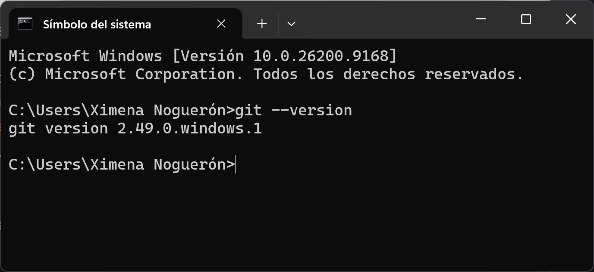
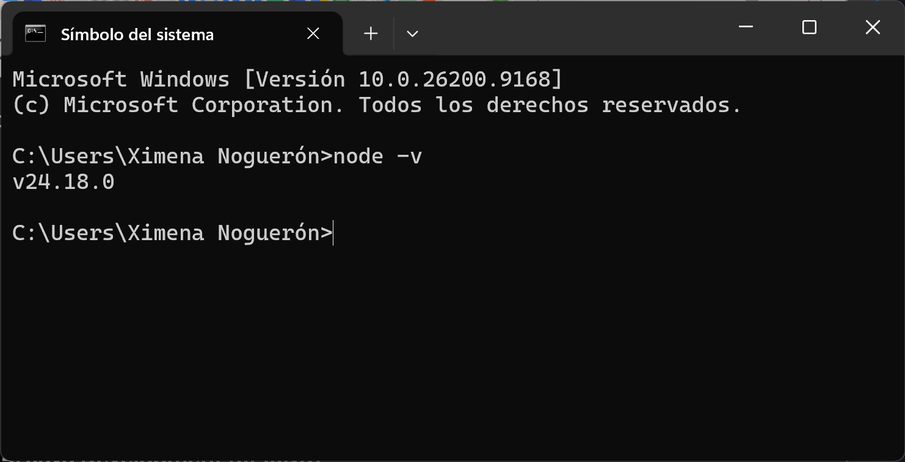
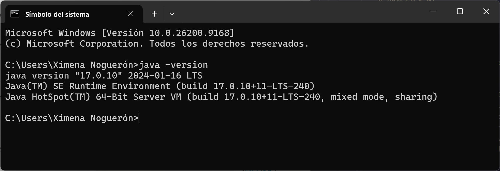
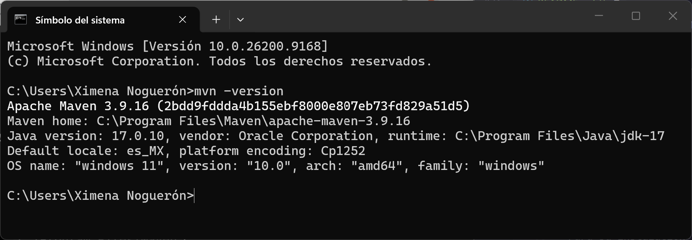
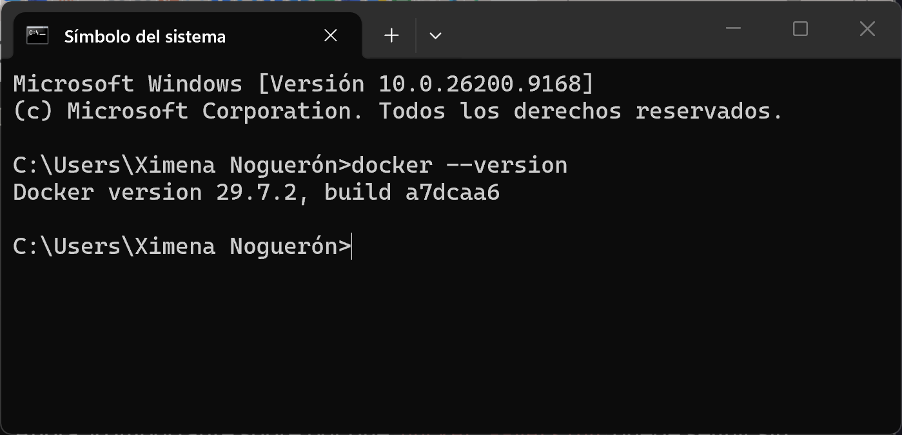
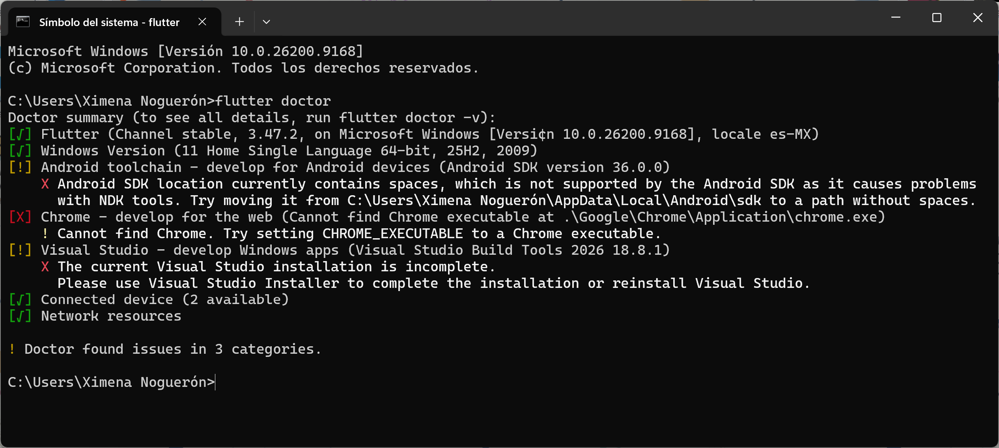
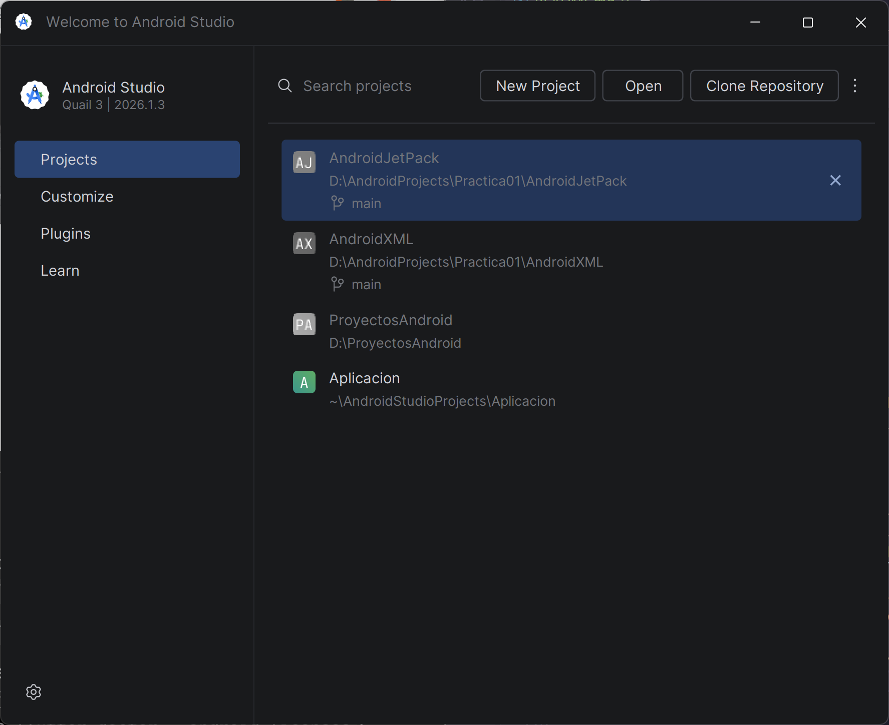
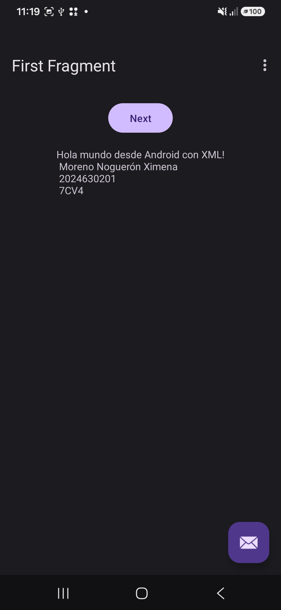
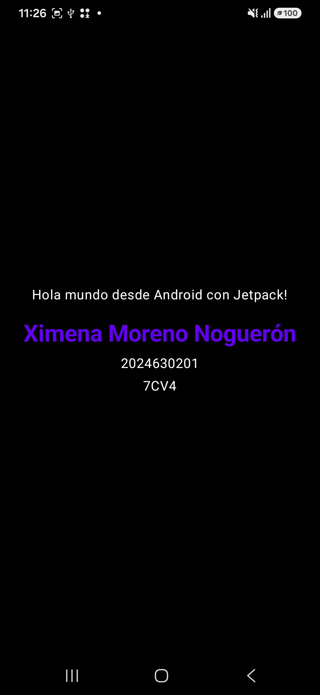
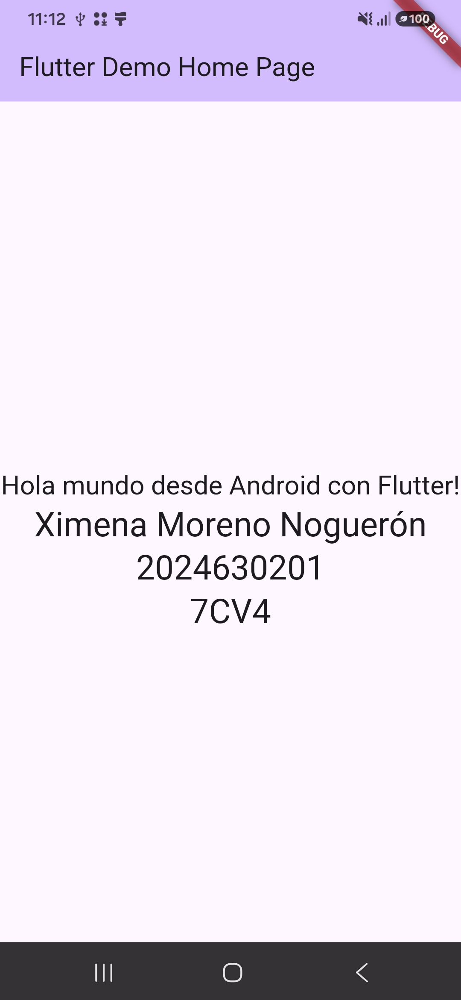

# PRÁCTICA 01
### Instalación y Funcionamiento de los Entornos Móviles

> Instalación, configuración y verificación de entornos de desarrollo.

---

## Objetivo

> Proyecto para la instalación, configuración y verificación del funcionamiento de los entornos de desarrollo necesarios para la construcción de aplicaciones móviles nativas, además de su integración con GitHub. Contiene 3 versiones de una aplicación básica empleando Views con XML, JetPack Compose y Flutter.

---

## Contexto y problema

> Para el desarrollo de aplicaciones móviles nativas de forma gratuita se usa el sistema operativo *Android*, basado en el núcleo de Linux y software de código abierto. Permite conectar el hardware del dispositivo con las aplicaciones y el usuario, al ser de código abierto permite a múltiples usuarios su desarrollo y personalización, siendo compatible con múltiples fabricantes como Samsung, Xiaomi y Motorola.

---

## Requisitos

> Se requieren especificaciones de Hardware para instalar el IDE de Andorid Studio, que nos permitirá desarrollar aplicaciones móviles.

### Hardware (requisitos mínimos)
- Windows 10 de 64bits.
- 8GB de RAM.
- 8GB de espacio libre sin emulador, con emulador 16GB.

### IDE y Versionado
- Android Studio
- Git

### Herramientas Adicionales
- Java Development Kit (JDK)
- Maven
- GitHub
- Flutter
- Node.js
- Docker

<small>Conoce más en: [Cómo instalar Android Studio](https://developer.android.com/studio/install?hl=es-419)</small>

---

## Instalación

> Pasos para la instalación de cada requisito para crear aplicaciones móviles.

### Git
Permite el control de versiones, trabajo colaborativo y la creación de repositorios conectados de forma remota.

Para su instalación se siguen los siguientes pasos:
1. Descargar el ejecutable de Git para Windows. [Install Git](https://git-scm.com/install/windows).
2. Ejecutar el archivo descargado.
3. Durante el asistente de instalación, seleccionar **Git Bash** y dejar marcadas las opciones por defecto.
4. Confirmar la instalación con el comando:

```bash
git --version
```


### Node.js
Es un entorno de ejecución para lenguaje JavaScript open-source y multiplataforma que permite crear servidores, aplicaciones web y scripts.

Para su instalación se siguen los siguientes pasos:
1. Descargar el ejecutable de Node.js para Windows. [Download Node.js](https://nodejs.org/en/download).
2. Ejecutar el archivo descargado.
3. Durante la ejecución del instalador, marcar la casilla para agregar Node.js al PATH.
4. Verificar la instalación mediante el comando:

```bash
node -v
```


### Java Development Kit (JDK)
Kit de desarrollo de Java que proporciona todas las herramientas necesarias para crear, compilar y ejecutar aplicaciones. Incluye componentes esenciales como el compilador de lenguaje Java, el depurador y el entorno de ejecución, que contiene la **Máquina Virtual de Java (JVM)**.

Para su instalación se siguen los siguientes pasos:
1. Descargar el JDK 17 para Windows. [Java SE 17 Archive Downloads (17.0.12 and earlier)](https://www.oracle.com/java/technologies/javase/jdk17-archive-downloads.html).
2. Instalar el paquete ejecutable (.msi).
3. Configurar la variable de entorno de sistema JAVA_HOME, apuntando a la ruta de instalación de la carpeta _bin_ al PATH.
4. Verificar la instalación mediante el comando:

```bash
node -v
```


### Apache Maven
Es un gestor de proyectos de Java de código abierto. Estandariza el ciclo de vida del desarrollo de software, abarcando desde la compulación hasta la creación y ejecución de pruebas unitarias junto con su documentación.

Para su instalación se siguen los siguientes pasos:
1. Descargar el archivo **.zip** de la versión binaria. [Downloading Apache Maven and Maven Daemon](https://maven.apache.org/download.cgi).
2. Extraer el contenido en una carpeta permanente dentro de los **Archivos de Programa**.
3. Crear la variable de entorno MAVEN_HOME, apuntando a la ruta de instalación de la carpeta, además de añadir *%MAVEN_HOME%/bin* al PATH del sistema.
4. Verificar la instalación mediante el comando:

```bash
mvn -version
```


### Docker
Es una plataforma de código abierto que permite crear, desplegar y ejecutar aplicaciones de manera rápida y consistente mediante el uso de **contenedores**. Los contenedores son unidades estandarizadas y ligeras que empaquetan el código de la aplicación junto con todas sus dependencias, bibliotecas y configuraciones, asegurando que el software funcione igual en cualquier entorno informático.

Para su instalación se siguen los siguientes pasos:
1. Abrir una terminal *cmd* en modo **Administrador**.
2. Ejecutar el comando:

```bash
winget install -e --id Docker.DockerDesktop --accept-source-agreements --accept-package-agreements
```

3. Cerrar la terminal y abrir una nueva.
4. Abrir la aplicación **Docker Desktop** hasta que termine su ejecución inicial.
5. Verificar la instalación mediante el comando:

```bash
docker --version
```


### Flutter
Es un framework UI de código abierto para crear aplicaciones compiladas de forma nativa para múltiples plataformas (móviles, web, escritorio e integradas), utilizando una única base de código. Facilita el desarrollo multiplataforma mediante el uso del lenguaje de programación **Dart** y su propio motor gráfico.

Para su instalación se siguen los siguientes pasos:
1. Abrir Visual Studio Code y buscar en el apartado de **Extensiones** la opción *Flutter*.
2. Instalar la extensión.
3. Abrir y verificar su instalación, a partir de crear un Nuevo Proyecto.
4. Visual Studio generará la opción de **Instalar SDK**, se debe indicar la carpeta que se desee para la instalación.
5. Permitir que Visual Studio agregue Flutter al PATH del sistema.
6. Verificar la instalación mediante el comando:

```bash
flutter doctor
```



### Android Studio
Es el entorno de desarrollo integrado (IDE) oficial para la plataforma Android, desarrollado y mantenido por Google. Permite crear, depurar, probar y empaquetar aplicaciones móviles nativas.

Para su instalación se siguen los siguientes pasos:
1. Descargar el instalador de Android Studio. [Descargar Android Studio](https://developer.android.com/?hl=es-419).
2. Abrir el asistente y darle permisos de instalación para **Android SDK**, **SDK-Platform-Tools** y, si se desea, configurar el **emulador**.
3. Verificar la instalación al abrir el IDE.



---

## Desarrollo

> Para comprobar que nuestro entorno de desarrollo está completo y todas las herramientas funcionan entre sí, se realizó un proyecto sencillo en 3 diferentes enfoques de desarrollo para Android.

### Android Nativo con Views (XML)
1. Dentro de Android Studio, se crea un nuevo proyecto con la plantilla **Empty Views Activity**, y lenguaje Kotlin.
2. De forma automática, se despliega un proyecto de ejemplo completamente modificable por el programador.
3. Para ejecutar la aplicación, se debió haber instalado el emulador o conectado un dispositivo móvil que sea Android y tenga configurado los permisos de desarrollador.
4. Verificamos la carga de la aplicación mediante el dispositivo seleccionado.



### Android Nativo con Jetpack Compose
1. Dentro de Android Studio, se crea un nuevo proyecto con la plantilla **Empty Activity (Jetpack Compose)**, y lenguaje Kotlin.
2. De forma automática, se despliega un proyecto de ejemplo completamente modificable por el programador.
3. Para ejecutar la aplicación, se debió haber instalado el emulador o conectado un dispositivo móvil que sea Android y tenga configurado los permisos de desarrollador.
4. Verificamos la carga de la aplicación mediante el dispositivo seleccionado.



### Flutter
1. Dentro de una terminal, nos colocamos en la dirección donde crearemos el proyecto de Flutter.
2. Utilizamos el comando `flutter [nombreProyecto]` para que nos cree una carpeta con el proyecto completo.
3. De forma automática, se despliega un proyecto de ejemplo completamente modificable por el programador.
4. Abrimos Android Studio para abrir el proyecto en la ruta donde fue creado.
5. Verificamos la carga de la aplicación mediante el dispositivo seleccionado.



---

## Resultados
La creación de los 3 proyectos son guardados en el Repositorio general de la materia **Aplicaciones Móviles**, donde se subirán las demás prácticas posteriormente.

### Comparación entre los tres enfoques

| Enfoque | Facilidad de desarrollo | Cantidad de código | Diseño de la interfaz |
|---|---|---|---|
| **Flutter** (Dart) | La más complicada: la instalación y configuración del SDK y del *toolchain* de Android es tediosa y pesada. | Media-alta: árboles de *widgets* muy anidados que complican la lectura. | Motor de render propio; *widgets* Material/Cupertino con aspecto idéntico en Android e iOS. |
| **XML** (vistas tradicionales) | Intuitiva y visual —separa diseño y lógica—, pero lenta para iterar y en rendimiento. | Alta: se reparte entre archivos `.xml` y `.kt`, con *boilerplate* (enlace de vistas, adaptadores). | Declarativo en XML con editor visual; se basa en una jerarquía de *Views*. |
| **Jetpack Compose** (Kotlin) | La más ágil: todo en un solo lenguaje, con *preview* y recarga en caliente. | Baja: UI declarativa y reactiva, sin XML por separado. | UI programática con funciones `@Composable`; el estado actualiza la vista automáticamente. |

**Conclusión:** En mi experiencia, **Jetpack Compose** es el mejor enfoque, debido a que reduce la cantidad de código, mantiene todo en Kotlin y agiliza el desarrollo como en un inicio es, la creación de diferentes líneas y funciones dentro de un programa que se comunican entre sí. **XML** resulta más intuitivo al inicio, pero se vuelve lento; y **Flutter**, aunque potente y multiplataforma, es el más complicado y pesado por lo tedioso de su instalación y los recursos que necesita para desarrollar una primera aplicación.

---

## Referencias

- [Build better apps faster with Jetpack Compose](https://developer.android.com/compose)
- [Understanding Jetpack Compose - part 1 of 2](https://medium.com/androiddevelopers/understanding-jetpack-compose-part-1-of-2-ca316fe39050)
- [Cómo crear diseños XML para Android](https://developer.android.com/codelabs/basic-android-kotlin-training-xml-layouts?hl=es-419#0)
- [¿Qué es Flutter?](https://aws.amazon.com/es/what-is/flutter/)
- [Flutter](https://aurestic.es/que-es-flutter/)

---

<sub>👤 **Autor:** [Ximena Moreno Noguerón] · 📆 [03/09/2026]</sub>