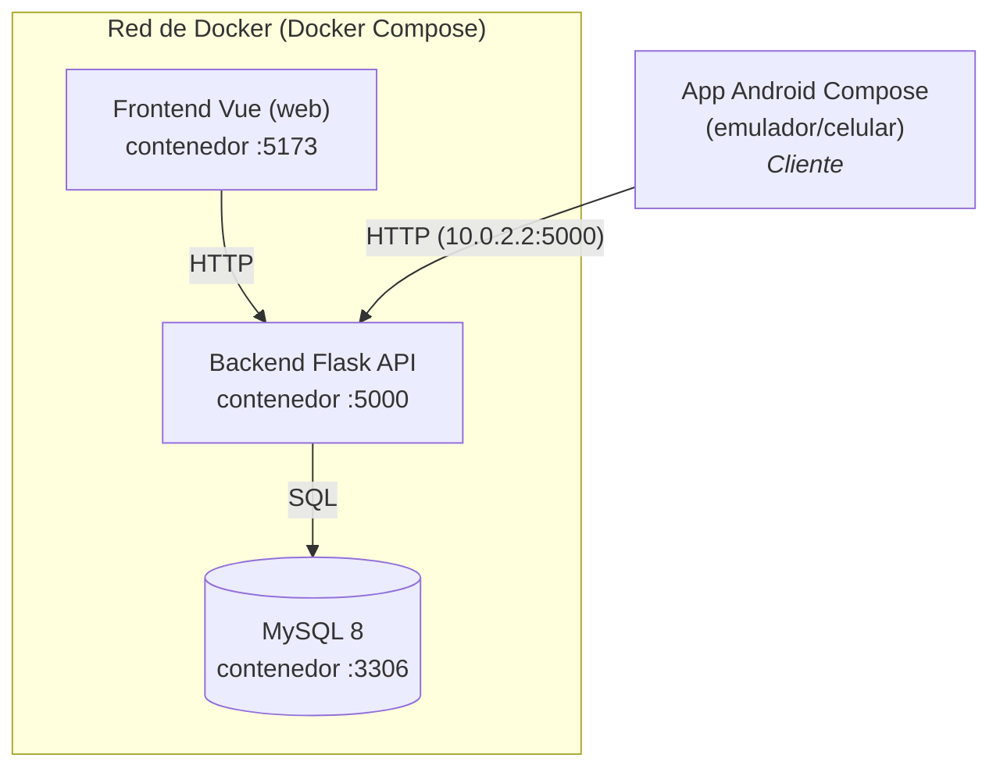
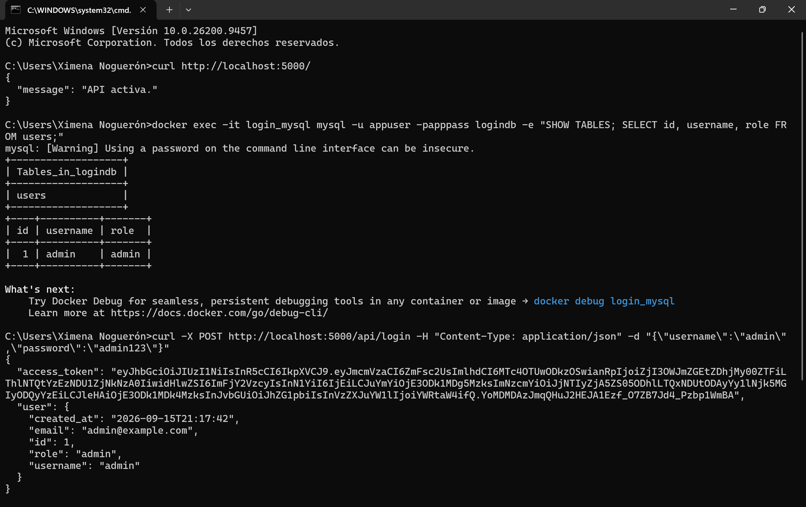

# Práctica 02
### Aplicación Móvil Básica para Operaciones CRUD con un Servicio REST

> Sistema de registro / inicio de sesion con CRUD de usuarios y control por rol (admin / user). Tres servicios en Docker orquestados por un solo `docker-compose.yml` (MySQL + Flask + Vue), mas una app Android que se conecta al backend.

---

## Objetivo

> El propósito de esta práctica es desarrollar una aplicación móvil que permita realizar operaciones CRUD (Crear, Leer, Actualizar, Borrar) sobre un servicio REST dockerizado. Además, la implementación de un sistema de autenticación que permita el inicio de sesión y el registro de usuarios, asegurando que las contraseñas estén encriptadas y las sesiones sean seguras.

---

## Estructura del repositorio

    Practica02/
    ├── docker-compose.yml     <- orquesta los 3 servicios
    ├── .env                   <- credenciales y claves
    ├── backend/               <- API Flask (Dockerfile, app.py, models, config)
    ├── frontend/              <- app Vue + Vite (Dockerfile, src/)
    └── android/               <- guia y snippets del cliente Compose

---

## Arquitectura

---

## Requisitos

- Docker Desktop (incluye Docker Compose)
- Android Studio (solo para el cliente movil)

---

## Docker

Es una plataforma de código abierto que permite crear, desplegar y ejecutar aplicaciones de manera rápida y consistente mediante el uso de **contenedores**, los cuales empaquetan el código fuente junto con todas sus dependencias, bibliotecas y configuraciones para garantizar que el software funcione de la misma forma en cualquier entorno informático.

Para lograrlo, se hace uso de los **Dockerfile**: archivos con el paso a paso necesario para la construcción de la *imagen* de cada servicio (para la base de datos, el backend y el frontend). Una imagen actúa como la plantilla estática a partir de la cual se generan los contenedores en ejecución. Dentro de esta se define el sistema operativo base, el lenguaje/entorno de desarrollo, las librerías y dependencias.

Finalmente, para integrar y ejecutar los 3 servicios de manera conjunta, se utiliza un archivo *docker-compose.yml*, que centraliza la configuración de un **Docker Compose**, la herramienta encargada de orquestar, conectar y administrar aplicaciones compuestas por múltiples contenedores de forma sencilla.

---

## Base de Datos

Para la creación de la base de datos en Docker, se crea el servicio dentro del **docker-compose.yml**, indicando su imagen, el nombre del contenedor, las credenciales, el puerto donde se ejecutará, entre otras configuraciones necesarias para el levantamiento del servicio.

Se crea un archivo `.env`, donde se almacenan las variables de entorno para guardar las credenciales del usuario.

1. Para levantar el servicio y verificar que está funcionando, se utiliza el siguiente comando. Esto deja corriendo el servicio en segundo plano mientras se descarga la imagen, se realiza la configuración del contenedor y se alza el servicio.

    `docker compose up -d`

2. Se revisa el estatus del contenedor con el comando:

    `docker compose ps`

3. Se puede utilizar el comando para ver el arranque en detalle:

    `docker compose logs mysql`

4. Para confirmar que el contenedor acepta conexiones e interactuar con la base de datos recién creada, se ejecuta un comando directo dentro del contenedor en ejecución, que nos devolverá el nombre de la base de datos:

    `docker exec -it login_mysql mysql -u appuser -papppass logindb -e "SELECT DATABASE();"`

5. Para apagar el servicio se utiliza el comando:

    `docker compose down`

<small>Salida esperada de la verificación de la base de datos.</small>

---

## Backend

Para la creación del backend se utilizó **Python con Flask**, framework de desarrollo web diseñado para crear aplicaciones web, APIs RESTFUL y microservicios de forma rápida, ligera y flexible.

Está estructurado bajo una arquitectura modular que separa la *configuración, el mapeo de datos y la lógica de negocio* en componentes independientes:

* `config.py`: administra la conexión hacia la base de datos (a partir de su contenedor) utilizando la libería **SQLAlchemy** como ORM (Object-Relational Mapping). Carga de forma segura las credenciales y claves de cifrado desde las variables de entorno.
* `models.py`: define la estructura, tablas y tipos de datos en la base de datos mediante clases de Python, mapeando las entidades.
* `app.py`: se define la API RESTful para la gestión de usuarios y autenticación. Además, crea la tabla *users* de la base de datos, e ingresa automáticamente un usuario con rol administrador si la tabla está vacía, implementando la función `seed_admin(app)`.

### Endpoints de la API

| Metodo | Ruta                | Acceso                       |
|--------|---------------------|------------------------------|
| POST   | /api/register       | publico (crea con rol 'user') |
| POST   | /api/login          | publico (devuelve JWT) |
| GET    | /api/me             | autenticado                    |
| GET    | /api/users          | solo admin |
| PUT    | /api/users/{id}     | admin (incl. rol) o el propio usuario |
| DELETE | /api/users/{id}     | solo admin o el propio usuario |

### Pruebas de funcionamiento y verificación

1. Para levantar el backend desde Docker se utiliza el comando:

    `docker compose up --build backend`

2. Para confirmar que el backend creó las tablas en la base de datos se utiliza el comando:

    `docker exec -it login_mysql mysql -u appuser -papppass logindb -e "SHOW TABLES; SELECT id, username, role FROM users;"`

3. Para corroborar el correcto funcionamiento del servidor con Docker, la conexión a la base de datos y la funcionalidad del proceso de inicio de sesión, se utiliza el siguiente comando, que devuelve el *access_token* del usuario conectado:

    `curl -X POST http://localhost:5000/api/login -H "Content-Type: application/json" -d "{\"username\":\"admin\",\"password\":\"admin123\"}"`

<small>Salida esperada de la verificación del backend.</small>

---

## Frontend

---

## Android

---

