# Práctica 02

#### Moreno Noguerón Ximena
#### 2024630201
#### 7CV4 - Aplicaciones Móviles Nativas
#### Profesor Gabriel Hurtado Avilés
#### Fecha de entrega 18 de Sept. 2026

---
### Aplicación Móvil Básica para Operaciones CRUD con un Servicio REST

> Sistema de registro / inicio de sesion con CRUD de usuarios y control por rol (admin / user). Tres servicios en Docker orquestados por un solo `docker-compose.yml` (MySQL + Flask + Vue), mas una app Android que se conecta al backend.

---

## Objetivo

> El propósito de esta práctica es desarrollar una aplicación móvil que permita realizar operaciones CRUD (Crear, Leer, Actualizar, Borrar) sobre un servicio REST dockerizado. Además, la implementación de un sistema de autenticación que permita el inicio de sesión y el registro de usuarios, asegurando que las contraseñas estén encriptadas y las sesiones sean seguras.

---

## Estructura del repositorio

    Practica02/
    ├── docker-compose.yml     <- orquesta los 3 servicios
    ├── .env                   <- credenciales y claves
    ├── backend/               <- API Flask (Dockerfile, app.py, models, config)
    ├── frontend/              <- app Vue + Vite (Dockerfile, src/)
    └── android/               <- guia y snippets del cliente Compose

---

## Arquitectura

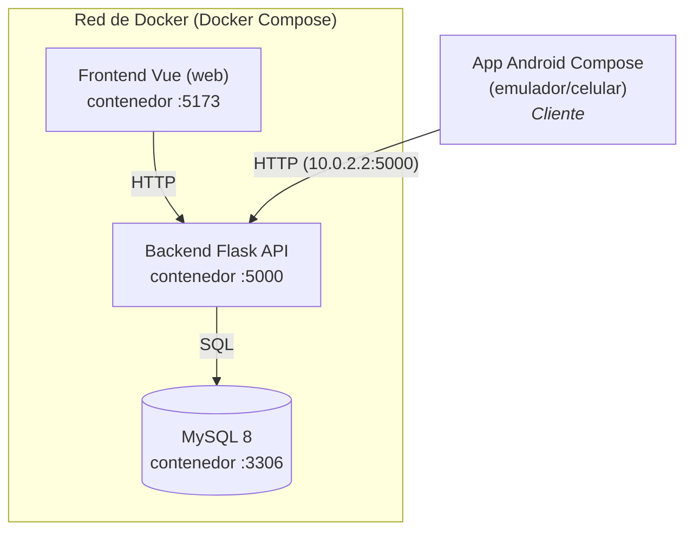

---

## Requisitos

- Docker Desktop (incluye Docker Compose)
- Android Studio (solo para el cliente movil)

---

## Acciones y permisos por rol

La siguiente tabla resume las acciones disponibles en el sistema y qué tipo de usuario puede realizar cada una. Se distinguen tres niveles: **visitante** (sin sesión iniciada), **usuario** (rol `user`) y **administrador** (rol `admin`).

| Acción | Visitante | Usuario | Administrador |
|--------|:---------:|:-------:|:-------------:|
| Registrarse (crear cuenta propia) | ✅ | ✅ | ✅ |
| Iniciar sesión | ✅ | ✅ | ✅ |
| Consultar su propio perfil | ❌ | ✅ | ✅ |
| Editar sus propios datos | ❌ | ✅ | ✅ |
| Eliminar su propia cuenta | ❌ | ✅ | ✅ |
| Ver la lista de todos los usuarios | ❌ | ❌ | ✅ |
| Crear usuarios (con rol a elegir) | ❌ | ❌ | ✅ |
| Editar datos de cualquier usuario | ❌ | ❌ | ✅ |
| Cambiar el rol de cualquier usuario | ❌ | ❌ | ✅ |
| Eliminar cualquier usuario | ❌ | ❌ | ✅ |
| Cerrar sesión | ❌ | ✅ | ✅ |

> **Nota:** aunque un usuario con rol `user` puede editar sus propios datos, el backend ignora cualquier intento de modificar su propio campo `role`; únicamente un administrador puede asignar o cambiar roles.

---

## Ejecución del proyecto

### 1. Levantar el sistema con Docker
Con **Docker Desktop abierto**, desde la carpeta raíz `Practica02/`, un solo comando construye y levanta los 3 servicios (base de datos, backend y frontend):

    docker compose up -d --build

Esto descarga las imágenes, levanta el backend y el frontend, crea la base de datos *logindb*, genera la tabla *users* y genera un usuario administrador por defecto.

### 2. Verificación del servicio de Docker

    docker compose ps

Deben aparecer `login_mysql`, `login_backend` y `login_frontend` en estado *Up*.

### 3. Abrir la aplicación web
Con los contenedores corriendo, abrir en el navegador:
    
    http://localhost:5173

Iniciar sesión con `admin` / `admin123`.

### 4. Abrir la aplicación móvil
1. Abrir la carpeta `/android` como proyecto en *Android Studio* y esperar a que se sincronice Gradle.
2. Configurar la dirección del backend en los archivos `RetrofitClient.kt` y en `network_security_config.xml` según dónde se ejecute la app:
    - **Emulador:** `http://10.0.2.2:5000/`, dirección por defecto de Docker.
    - **Celular físico:** `http://<IP-LOCAL>:5000/`. Puedes obtener la IP de tu computadora ejecutando `ipconfig` dentro del **Símbolo del sistema**, tomando la dirección IPv4 del Adaptador de LAN inalámbrica Wi-Fi. Para que funcione el celular y la PC deben estar en la **misma red**.
3. Conectar el dispositivo o iniciar un emulador y ejecutar la aplicación con el botón **Run** (▶).
4. Iniciar sesión con las mismas credenciales `admin` / `admin123`.

> *Nota:* También es posible entrar a la aplicación web utilizando la dirección web `http://<IP-LOCAL>:5173/`

---

## Docker

Es una plataforma de código abierto que permite crear, desplegar y ejecutar aplicaciones de manera rápida y consistente mediante el uso de **contenedores**, los cuales empaquetan el código fuente junto con todas sus dependencias, bibliotecas y configuraciones para garantizar que el software funcione de la misma forma en cualquier entorno informático.

Para lograrlo, se hace uso de los **Dockerfile**: archivos con el paso a paso necesario para la construcción de la *imagen* de cada servicio (para la base de datos, el backend y el frontend). Una imagen actúa como la plantilla estática a partir de la cual se generan los contenedores en ejecución. Dentro de esta se define el sistema operativo base, el lenguaje/entorno de desarrollo, las librerías y dependencias.

Finalmente, para integrar y ejecutar los 3 servicios de manera conjunta, se utiliza un archivo *docker-compose.yml*, que centraliza la configuración de un **Docker Compose**, la herramienta encargada de orquestar, conectar y administrar aplicaciones compuestas por múltiples contenedores de forma sencilla.

---

## Base de Datos

Para la creación de la base de datos en Docker, se crea el servicio dentro del **docker-compose.yml**, indicando su imagen, el nombre del contenedor, las credenciales, el puerto donde se ejecutará, entre otras configuraciones necesarias para el levantamiento del servicio.

Se crea un archivo `.env`, donde se almacenan las variables de entorno para guardar las credenciales del usuario.

### Pruebas de funcionamiento y verificación

1. Para levantar el servicio y verificar que está funcionando, se utiliza el siguiente comando. Esto deja corriendo el servicio en segundo plano mientras se descarga la imagen, se realiza la configuración del contenedor y se alza el servicio.

    `docker compose up -d`

2. Se revisa el estatus del contenedor con el comando:

    `docker compose ps`

3. Se puede utilizar el comando para ver el arranque en detalle:

    `docker compose logs mysql`

4. Para confirmar que el contenedor acepta conexiones e interactuar con la base de datos recién creada, se ejecuta un comando directo dentro del contenedor en ejecución, que nos devolverá el nombre de la base de datos:

    `docker exec -it login_mysql mysql -u appuser -papppass logindb -e "SELECT DATABASE();"`

5. Para apagar el servicio se utiliza el comando:

    `docker compose down`

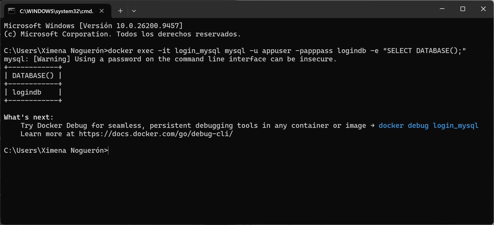

<small>Salida esperada de la verificación de la base de datos.</small>

---

## Backend

Para la creación del backend se utilizó **Python con Flask**, framework de desarrollo web diseñado para crear aplicaciones web, APIs RESTFUL y microservicios de forma rápida, ligera y flexible.

Está estructurado bajo una arquitectura modular que separa la *configuración, el mapeo de datos y la lógica de negocio* en componentes independientes:

* `config.py`: administra la conexión hacia la base de datos (a partir de su contenedor) utilizando la libería **SQLAlchemy** como ORM (Object-Relational Mapping). Carga de forma segura las credenciales y claves de cifrado desde las variables de entorno.
* `models.py`: define la estructura, tablas y tipos de datos en la base de datos mediante clases de Python, mapeando las entidades.
* `app.py`: se define la API RESTful para la gestión de usuarios y autenticación. Además, crea la tabla *users* de la base de datos, e ingresa automáticamente un usuario con rol administrador si la tabla está vacía, implementando la función `seed_admin(app)`.

### Endpoints de la API

| Metodo | Ruta                | Acceso                       |
|--------|---------------------|------------------------------|
| POST   | /api/register       | publico (crea con rol 'user') |
| POST   | /api/login          | publico (devuelve JWT) |
| GET    | /api/me             | autenticado |
| GET    | /api/users          | solo admin |
| POST   | /api/users          | solo admin (crea con rol a elegir) |
| PUT    | /api/users/{id}     | admin (incl. rol) o el propio usuario |
| DELETE | /api/users/{id}     | solo admin o el propio usuario |

### Pruebas de funcionamiento y verificación

1. Para levantar el backend desde Docker se utiliza el comando:

    `docker compose up --build backend`

2. Para confirmar que el backend creó las tablas en la base de datos se utiliza el comando:

    `docker exec -it login_mysql mysql -u appuser -papppass logindb -e "SHOW TABLES; SELECT id, username, role FROM users;"`

3. Para corroborar el correcto funcionamiento del servidor con Docker, la conexión a la base de datos y la funcionalidad del proceso de inicio de sesión, se utiliza el siguiente comando, que devuelve el *access_token* del usuario conectado:

    `curl -X POST http://localhost:5000/api/login -H "Content-Type: application/json" -d "{\"username\":\"admin\",\"password\":\"admin123\"}"`

<small>Salida esperada de la verificación del backend.</small>

---

## Frontend

El desarrollo de la interfaz de usuario se realizó con **Vue.js**, un framework progresivo de JavaScript de código abierto que permite la construcción de interfaces de usuario dinámicas y aplicaciones de una sola página (SPA). Incluye herramientas de construcción de componentes, un modelo reactivo automático que optimiza la renderización de datos dentro de la aplicación, además de un sistema modular para incluir herramientas de navegación, gestión de estado, autenticación, etc.

Esta estructurado bajo una arquitectura modular para separar la lógica de presentación, el enrutamiento y la comunicación con la API, donde *cada funcionalidad agrupa sus propios componentes*:

* `package.json`: gestiona las dependencias, versiones y scripts de ejecución.
* `node_modules/`: guarda las dependencias instaladas y módulos de terceros.
* `src/`: directorio principal que aloja todas las funcionalidades del sistema. Incluye todo el código fuente.
    * `api.js`: define al cliente HTTP, gestiona la comunicación centralizada y el envío de peticiones hacia la API REST en Flask.
    * `router.js`: realiza la configuración de las rutas dentro de la aplicación del cliente.
    * `auth.js`: guarda la configuración de permisos de la aplicación, mantiene la gestión del estado de autenticación, la persistencia del token JWT y las guardas de navegación para proteger las rutas privadas.
    * `Views/`: guarda los componentes de la aplicación que representan las pantallas completas del sistema.

### Pruebas de funcionamiento y verificación

1.  Para levantar el frontend desde Docker se utiliza el comando:

    `docker compose up -d --build frontend`

2. Para inspeccionar la salida del servidor de desarrollo se utiliza el comando:

    `docker compose logs -f frontend`

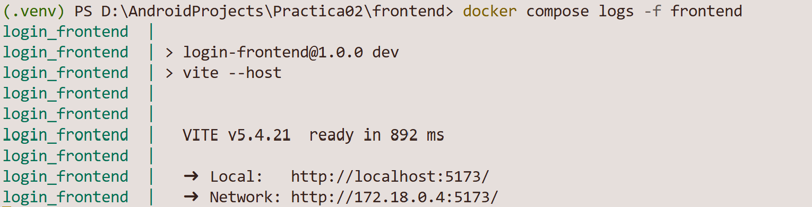

<small>Salida esperada de la verificación del frontend.</small>

---

## Android

La aplicación móvil nativa se desarrolló con **Kotlin y Jetpack Compose**, el kit de herramientas moderno y declarativo de Android para construir interfaces de usuario. A diferencia del enfoque tradicional basado en XML, Compose permite describir la interfaz mediante funciones (`@Composable`) que se redibujan automáticamente cuando cambia el estado, siguiendo el mismo paradigma reactivo del frontend en Vue. La aplicación es un **cliente** que consume el mismo servicio REST dockerizado, comunicándose con el backend mediante la librería **Retrofit**, que gestiona las peticiones HTTP y traduce automáticamente entre las clases de Kotlin y el formato JSON.

Está estructurada por capas que separan la *comunicación con la API, la gestión de la sesión y las pantallas*:

* `Models.kt`: define las clases de datos (`data class`) que reflejan la estructura del JSON que envía y recibe el backend (usuarios, cuerpos de petición y respuestas). La librería Gson las completa automáticamente durante la comunicación.
* `ApiService.kt`: declara la interfaz con todos los endpoints del backend mediante anotaciones (`@POST`, `@GET`, `@PUT`, `@DELETE`). Las rutas protegidas reciben el token JWT a través de la cabecera `Authorization`.
* `RetrofitClient.kt`: construye la instancia de Retrofit apuntando a la dirección del backend y registra un interceptor de logs para depurar las peticiones. Incluye el objeto `Sesion`, que mantiene en memoria el token y el usuario autenticado, y expone si la sesión está activa y si el usuario es administrador.
* `MainActivity.kt`: punto de entrada de la aplicación; establece el tema y muestra el componente principal `MainApp`.
* `MainApp.kt`: contiene la barra superior con el **menú desplegable de navegación**, que muestra distintas opciones según el estado de la sesión y el rol del usuario (Inicio de sesión y Registro para visitantes; Perfil, Usuarios y Salir para usuarios autenticados). Gestiona la navegación entre pantallas mediante una variable de estado.
* `LoginScreen.kt` y `RegistroScreen.kt`: pantallas públicas de autenticación y alta de usuarios.
* `PerfilScreen.kt`: muestra y permite editar los datos del usuario autenticado.
* `UsuariosScreen.kt` y `UsuarioDialog.kt`: pantalla de administración con el CRUD completo de usuarios (listar, crear, editar y eliminar) y el diálogo reutilizable para crear o editar, con selector de rol. Solo accesible para administradores.

La gestión del estado se realiza con `remember { mutableStateOf(...) }`, la carga inicial de datos con `LaunchedEffect`, y las llamadas de red se ejecutan de forma asíncrona mediante **corrutinas**. 

### Configuración de red

Al ser un cliente que se conecta por HTTP a un servidor en desarrollo, la aplicación requiere dos ajustes:

* En `AndroidManifest.xml` se declara el permiso de Internet (`android.permission.INTERNET`).
* En `res/xml/network_security_config.xml` se autoriza el tráfico sin cifrar (*cleartext*) hacia la dirección del backend, ya que Android lo bloquea por defecto.

La dirección del backend se configura en la constante `BASE_URL` de `RetrofitClient.kt` según el entorno de ejecución:

| Entorno | Dirección |
|---------|-----------|
| Emulador de Android Studio | `http://10.0.2.2:5000/` |
| Dispositivo físico | `http://<IP-LOCAL-DE-LA-PC>:5000/` (misma red Wi-Fi) |

### Pruebas de funcionamiento y verificación

1. Con los contenedores de Docker en ejecución (`docker compose up -d`), abrir la carpeta `android/` como proyecto en **Android Studio** y esperar a que sincronice Gradle.

2. Configurar la constante `BASE_URL` en `RetrofitClient.kt` con la dirección correspondiente al entorno (emulador o dispositivo físico), y verificar que dicha dirección esté incluida en `network_security_config.xml`.

3. Conectar un dispositivo o iniciar un emulador y ejecutar la aplicación con el botón **Run**.

4. Iniciar sesión con las credenciales del administrador (`admin` / `admin123`). Un administrador accede a la gestión de usuarios; un usuario normal accede a su perfil.

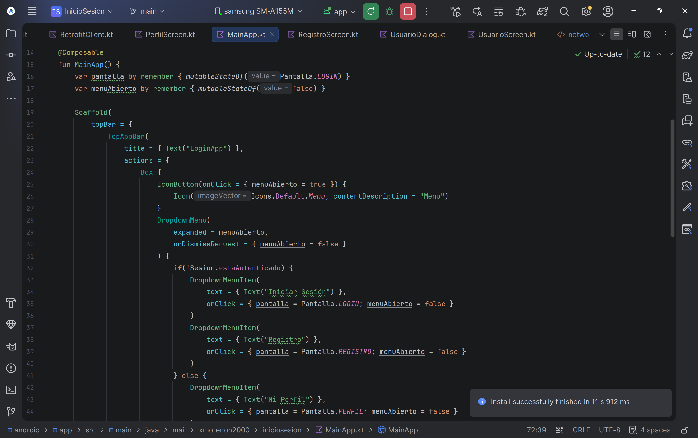

<small>Salida esperada de la ejecución de la App Android.</small>

---

## Comparación App Web vs App Móvil

| Vista | Web | Móvil |
| ----- | --- | ----- |
| Inicio de Sesión | 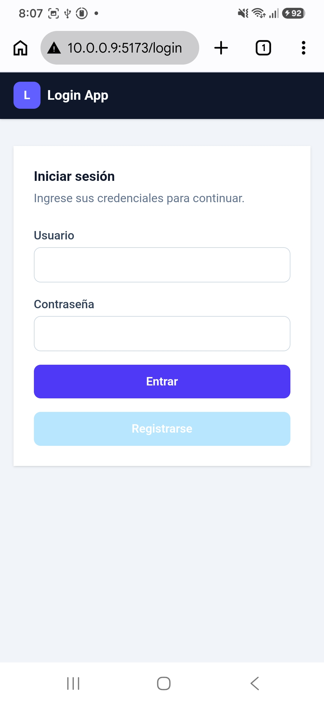 | 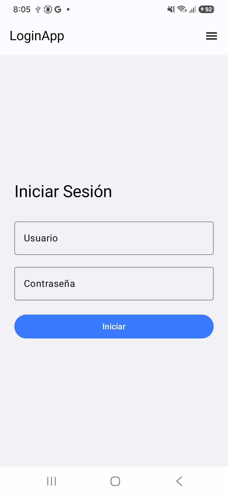 |
| Registro | 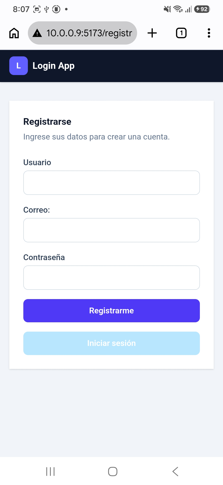 | 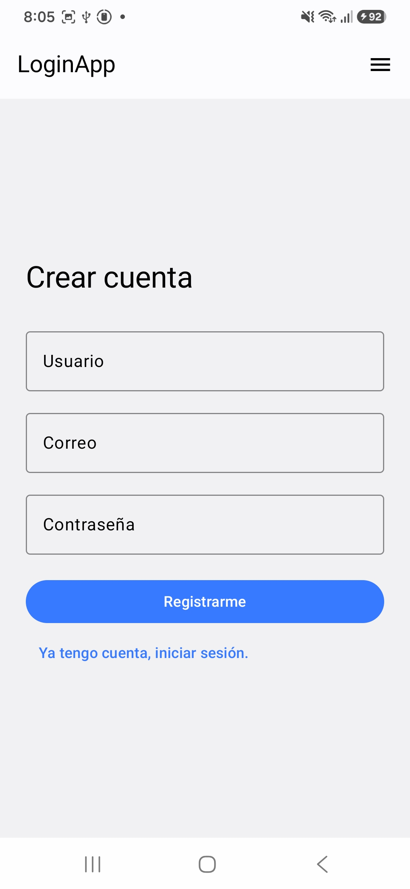 |
| Usuarios | 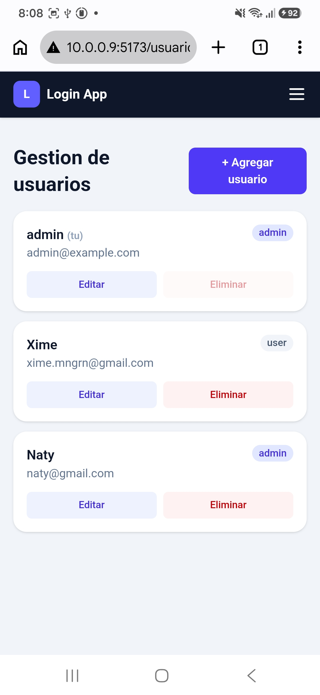 | 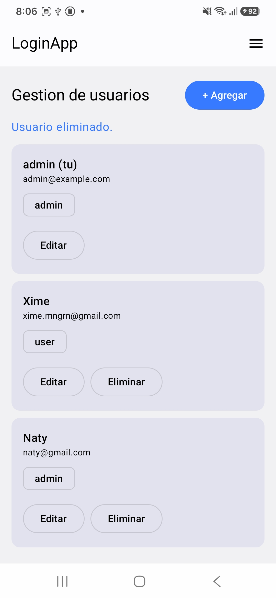 |
| Perfil | 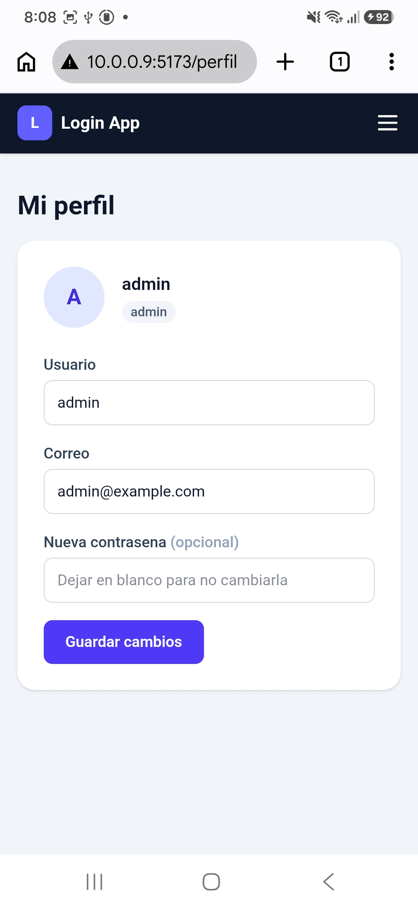 | 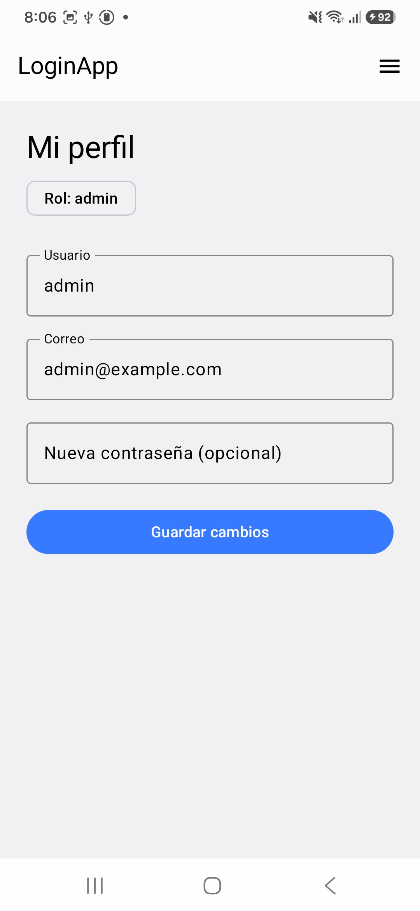 |

---

## Conclusiones

El desarrollo de esta práctica fue muy desafiante al incluir tecnologías nuevas: la creación de contenedores con Docker y el desarrollo con Jetpack Compose de una aplicación móvil nativa en Android. 

El primero es una herramienta sumamente útil que en un inicio es difícil de comprender y ejecutar, pues la forma en la que cada contenedor vive y se comunica con los demás orquestado por un archivo `.yml` es una abstracción que en un inicio no se observa.

La segunda, al tener varias opciones de desarrollo y un nuevo lenguaje para la creación de las aplicaciones, es una curva de aprendizaje nuevo al tener un modelo de desarrollo diferente a otros en el mercado. Sin embargo, la similitud de desarrollo con *Vue.js* ayudó mucho en el entendimiento de los Composables, cómo se estructura, cómo varía según el estado y cómo maneja sus variables y declaraciones.

A su vez, creo que la conexión a Internet desde Android es complicada de implementar debido a que se necesitan permisos especiales dentro de la aplicación para poder realizar la comunicación con el backend dentro de Docker, sin embargo el entendimiento y la implementación fue una experiencia llena de aprendizaje para la mejora de próximas prácticas y desarrollo.

---

## Bibliografía
1. Aprende Jetpack Compose. (s/f). OpenCompose. Recuperado el 19 de septiembre de 2026, de https://www.jetpackcompose.pro/home/guide/
2. Conexión a Internet en Android Studio con Retrofit | Jetpack Compose. (2026, febrero 3). [Video recording]. https://programacionymas.com/blog/consumir-una-api-usando-retrofit 
3. EDteam [@EDteam]. (s/f). ¿Qué es Docker y Kubernetes? [[Object Object]]. Youtube. Recuperado el 19 de septiembre de 2026, de https://www.youtube.com/watch?v=gjRoNFopFig
4. ¿Qué es Docker y cómo funciona? Ventajas de los contenedores Docker. (s/f). Redhat.com. Recuperado el 19 de septiembre de 2026, de https://www.redhat.com/es/topics/containers/what-is-docker
5. programacionymas.com. Programacionymas.com. Retrieved September 19, 2026, from https://programacionymas.com/blog/consumir-una-api-usando-retrofit

